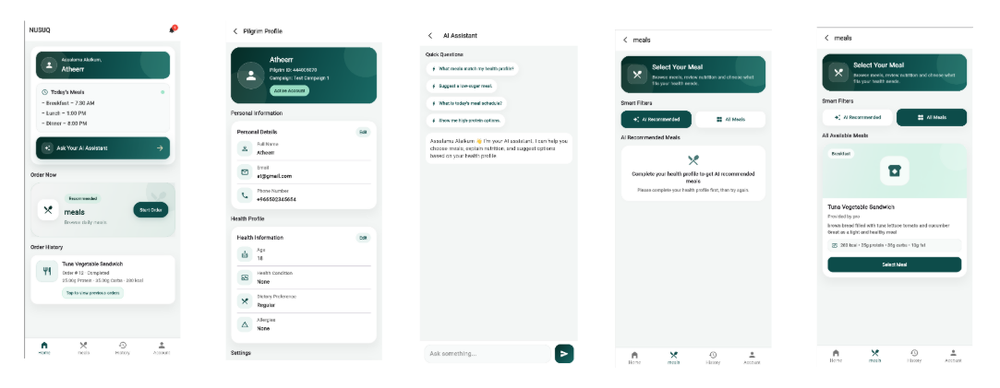
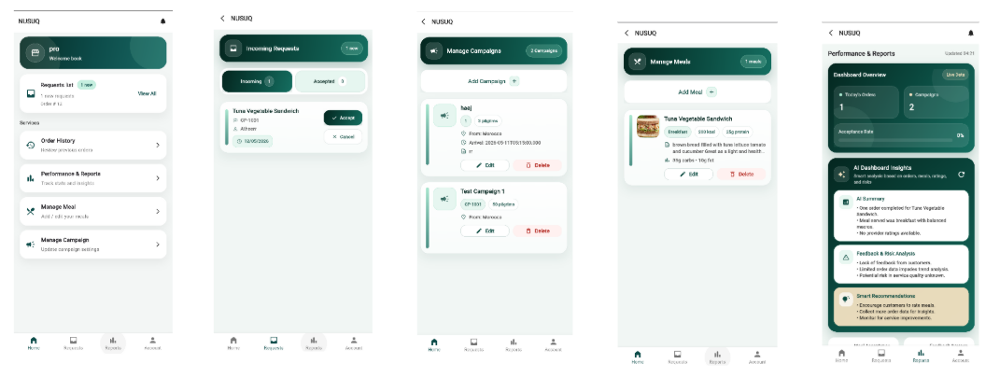
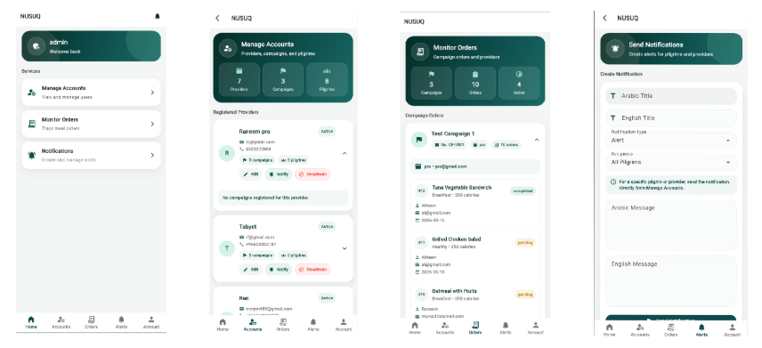

# NUSUQ - Smart Catering & Nutrition Management System

<p align="center">
  <strong>AI-powered smart catering platform for Hajj and Umrah pilgrims</strong>
</p>

<p align="center">
  
  
  
  
</p>

## Overview

**NUSUQ** is a graduation project that provides an integrated smart catering management system for Hajj and Umrah services. The system supports pilgrims, meal providers, and administrators through a unified mobile application that connects health profiles, meal ordering, campaign management, provider operations, and AI-powered insights.

The main goal of NUSUQ is to help pilgrims receive meals that better match their health needs, while helping catering offices estimate meal demand, improve operational planning, and reduce food waste.

## Problem

Catering services during Hajj and Umrah often face challenges such as:

- Difficulty understanding pilgrims' health and dietary needs.
- Preparing meals without accurate demand expectations.
- Food waste caused by overproduction or poor planning.
- Limited visibility for providers and administrators over orders, campaigns, and meal performance.

## Solution

NUSUQ addresses these challenges through three connected user roles:

### Pilgrim

- Create and update a health profile.
- View meals available through the selected campaign's catering provider.
- Receive AI-assisted meal guidance based on health information.
- Submit meal orders and track order history.
- Receive notifications and updates.

### Meal Provider

- Manage meals and meal details.
- Manage campaigns linked to pilgrims.
- Review incoming meal requests.
- Track order history and feedback.
- View AI dashboard insights for demand and risk analysis.

### Admin

- Manage providers, campaigns, and pilgrims.
- Monitor orders across campaigns and providers.
- Create and send notifications.
- View system-level operational data.

## Key Features

- AI-powered meal recommendation and dashboard insights.
- Health profile management for pilgrims.
- Meal and campaign management for providers.
- Order monitoring for providers and admins.
- Notification management in Arabic and English.
- Reports and performance dashboard.
- REST API integration between Flutter and Node.js backend.
- MySQL database integration.
- Bilingual interface support structure.

## Tech Stack

### Frontend

- Flutter
- Dart

### Backend

- Node.js
- Express.js
- OpenAI API


### Database

- MySQL
- SQL schema included in `database/nusuq_database.sql`


## Screenshots

### Authentication

<p align="center">
  
</p>

### Pilgrim Experience

<p align="center">
  
</p>

### Provider Experience

<p align="center">
  
</p>

### Admin Dashboard

<p align="center">
  
</p>


## Getting Started

### Prerequisites

Make sure you have the following installed:

- Flutter SDK
- Dart SDK
- Node.js
- MySQL
- Git

### Backend Setup

```bash
cd backend
npm install
cp .env.example .env
```

Update `.env` with your local database, email, and OpenAI credentials.

Then run:

```bash
node server.js
```

### Database Setup

1. Create a MySQL database.
2. Import the SQL file:

```bash
mysql -u root -p nusuq_database < database/nusuq_database.sql
```

3. Update the database variables in `backend/.env`.

### Flutter App Setup

From the project root:

```bash
flutter pub get
flutter run
```

## My Role

As the **Team Leader**, I coordinated the project planning and development process while contributing across multiple technical areas.

My responsibilities included:

- Leading the team and coordinating development tasks.
- Contributing to both frontend and backend development.
- Participating in database design and integration.
- Developing and connecting REST APIs.
- Supporting the AI-powered meal recommendation and dashboard insight features.
- Participating in system analysis and software engineering activities.
- Preparing, structuring, and organizing the complete project documentation and final report.
- Ensuring consistency between the system design, implementation, and documentation.

## Future Improvements

- Enhance the AI recommendation model with nutrition datasets.
- Add advanced demand forecasting for providers.
- Integrate wearable health data.
- Improve multilingual support for international pilgrims.
- Add real-time analytics for large-scale Hajj operations.
- Integrate with official Hajj and Umrah platforms.

## Notes

- The `.env` file is intentionally excluded for security reasons.
- Use `backend/.env.example` as a template for local setup.
- Screenshots shown in this README use sample testing data.

## Academic Context

This project was developed as a Software Engineering graduation project at Umm Al-Qura University.
